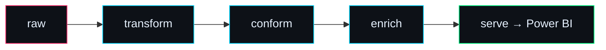

<!-- ░▒▓  animated matrix + glitch hero (self-hosted SVG, animates on GitHub)  ▓▒░ -->
<div align="center">
  <a href="https://github.com/syukrifadzil">
    
  </a>
</div>

<div align="center">


[](https://github.com/syukrifadzil?tab=followers)
[](mailto:msyukri_mf@yahoo.com)

</div>

<br/>

## 👋 Hey, I'm Syukri

I'm a **data engineer** in Kuala Lumpur. My day job is the unglamorous plumbing that keeps a cloud **data lake** alive — moving raw data through `transform → conform → enrich` until it's clean enough that people actually trust it in a dashboard.

Off the clock I build things that scratch an itch: a forecasting model here, a stock-monitoring app there, a food app for when my friends and I can't decide where to eat. Honestly, half of them will never make a cent. I build them anyway, because that's how I learn the fun stuff — ML, time-series, shipping real apps.

```console
syukri@kl ~ % whoami
> data engineer by day, builder by night
> i turn messy data into pipelines, then pipelines into dashboards people trust
> currently obsessed with time-series forecasting & brutally honest ML
```

<div align="center"></div>

## ⭐ Stuff I've built that I'm actually proud of

### 🛒 [store-sales-forecasting](https://github.com/syukrifadzil/store-sales-forecasting)

[](https://github.com/syukrifadzil/store-sales-forecasting)
[](https://github.com/syukrifadzil/store-sales-forecasting/commits)
[](https://github.com/syukrifadzil/store-sales-forecasting/stargazers)


My take on the Kaggle **Store Sales** competition. Instead of training 1,782 tiny models, I trained **one global LightGBM** across every store-and-product series at once, with lag features that are careful not to peek into the future. I wrote it to be *read*, not just run — the docstrings explain the *why*. If you're learning time-series, this is a good place to poke around.

> ⭐ Star it if you like clean, well-documented ML.

### 📈 [Pantau](https://github.com/syukrifadzil/stock-ml-monitor-dist) &nbsp;<sub>*(pantau = "to monitor" in Malay)*</sub>

[](https://github.com/syukrifadzil/stock-ml-monitor-dist/releases/latest)

[](https://github.com/syukrifadzil/stock-ml-monitor-dist/commits)


A desktop app that watches a **Bursa Malaysia** price-direction model — and it's stubbornly honest. Every signal sits right next to the accuracy it would *need* to be worth trading, and the app will tell you to your face when the edge just isn't there. A research tool, not a hype machine. Installers for all three platforms are in **Releases**.

> 💾 macOS · Windows · Linux — grab the latest build and try it.

<div align="center"></div>

## 🧪 On my workbench right now

A few things not quite ready for the world yet:

```text
🍜  makan-app ........... a KL food-discovery app, for the eternal "where do we eat?" debate
🛰️  personal-risk-radar . a personal-finance early-warning system
📊  stock-ml-monitor ..... the research engine that feeds Pantau
```

<sub>Private for now — follow along and you'll catch them the moment they go public.</sub>

<div align="center"></div>

## 🛠️ What I actually do all day

Picture a data lake as a line of filters, each one making the data a little cleaner and more useful:



I build and babysit those stages: **watermark-driven loads** so nothing gets processed twice, **Glue / PySpark** for the heavy lifting, **Step Functions + Lambda** to orchestrate it, **Athena** to query it, and **Power BI** on top so the business sees numbers they can trust. When two feeds disagree, I'm the one doing the record-by-record detective work to find out why.

### The toolbox


<br/>


<br/>


<div align="center"></div>

## 🐍 My commits, eaten by a snake

<div align="center">

<picture>
  <source media="(prefers-color-scheme: dark)" srcset="https://raw.githubusercontent.com/syukrifadzil/syukrifadzil/output/github-snake-dark.svg" />
  
</picture>

<br/><br/>


</div>

<div align="center"></div>

## 📡 Come say hi

<div align="center">

[](https://linkedin.com/in/syukrifadzil)
[](mailto:msyukri_mf@yahoo.com)
[](https://github.com/syukrifadzil?tab=repositories)

<br/>

<sub>Thanks for scrolling this far. Pick a project up top and poke around — and if you're building something in data or ML, my inbox is open. 🟢</sub>

</div>
